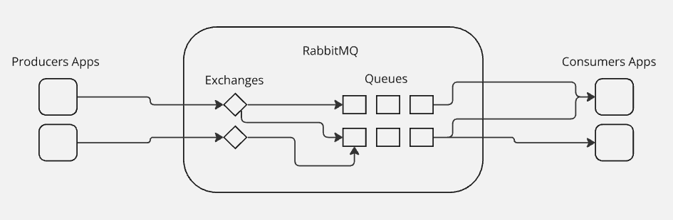

# RabbitMQ

O RabbitMQ é um **message broker** altamente consolidado e utilizado por quem trabalha com comunicação entre sistemas. Operando de forma assíncrona, ele age como um intermediário que processa as nossas mensagens entre produtores e consumidores, além de contar com filas que possuem diversas opções de encaminhamento.

O caso de uso do RabbitMQ, se dá quando se deseja utilizar arquitetura microservices, quando um serviço precisa se comunicar com outro, e essa comunicação não pode ser feita via API Web HTTP, pois a chamada API Web HTTP, requer obrigatoriamente uma chamada de sucesso, logo, ela é síncrono, diferente do RabbitMQ, que é assíncrono, e não obriga uma resposta/processamento imediato.

Por padrão, o RabbitMQ funciona com o algoritmo **Round-Robin**, que basicamente faz um ouvinte(consumer) receber a mensagem por vez. Logo, se temos 2 servidores, e o primeiro servidor foi o último a receber uma mensagem, o servidor 2 que irá receber a próxima. E assim ficará nesse Loop de 1 -> 2 -> 1 -> 2 -> 1 -> 2….

Isso ajuda o recurso computacional ser bem gasto, ficando proporcional. Se um servidor recebeu 50 mensagens em 1 segundo, o segundo servidor recebeu provavelmente 50 mensagens em 1 segundo também.

Caso o sistema precise escalar dinamicamente, o RabbitMQ também poderá ser utilizado, pois o servidor apenas precisará se conectar com ele via URL apenas. Você pode se conectar com RabbitMQ, tanto com 1 servidor, ou até milhares deles.

Outro benefício do uso do RabbitMQ, é o ponto de falha único, que é utilizado graças a mensagem assíncrona. O sistema não precisa esperar uma resposta, ou fazer requisição a um servidor, para iniciar o processamento da mensagem. Quando um serviço/servidor estiver disponível, automaticamente ele irá ouvir as mensagens do RabbitMQ, e dar continuidade nas mensagens presentes na fila.

Um caso por exemplo, onde você tem 2 servidores, e um servidor ocorreu um problema, e ficou offline. Apenas um servidor irá fazer a tarefa/processamento, mas irá realizar. Agora, caso os 2 servidores caiam, as mensagens ficarão armazenadas no sistema de filas do RabbitMQ, e poderão ser lidas(consumidas) quando o servidor voltar ao ar.

Ou seja, o RabbitMQ, permite que criemos sistemas escaláveis e independentes entre si. Mesmo se os servidores, que estão ouvindo o tópico, ficarem offline, as mensagens, ficaram salvas para serem processadas depois.

Vamos entender melhor essa dinâmica conhecendo os tipos de **Exchanges**, representando basicamente a troca de mensagens.

## Exchange
Pelas Exchanges, sempre que nós enviamos uma mensagem via RabbitMQ, nós não mandamos diretamente para uma fila, para outros sistemas já lerem, nós mandamos para uma Exchange, que é responsável por encaminhar as mensagens para diversas filas.

Os tipos de exchanges são:

    
Direct Exchange

## Direct Exchange

Para exemplificar, vamos imaginar que um producer precisa emitir uma mensagem de confirmação de compra para três consumers. Ou seja, o sistema precisa se comunicar com outros três diferentes sistemas para efetuar a compra.

Como o RabbitMQ envia a mensagem separadamente para cada fila, existe uma dinâmica para fazer com que esses outros sistemas recebam a mensagem diretamente.

Normalmente a exchange encaminha a mensagem para as filas, mas muitas vezes nós não queremos que as nossas mensagens sejam enviadas para todas as filas. Por isso existem diversas condições que nós podemos aplicar para fazer com que uma exchange funcione.

Então você tem a possibilidade de fazer com que a sua mensagem seja enviada para um consumer, apenas; ao invés de ser enviada para todos.

### Binding Key

Para conectar uma fila a uma exchange é preciso criar um bind, que é basicamente uma relação entre uma fila e uma exchange, como um de conector.

### Routing Key

Nesse bind nós também podemos criar um elemento chamado routing key, que em outras palavras é uma chave para encaminhar as nossas mensagens para uma fila específica.

Se você tem uma routing key X, uma routing key Y e uma routing key Z; a mensagem que estiver com a routing key Y, por exemplo, passará pela fila Y e será entregue diretamente ao consumidor que você definiu para receber a mensagem.

Dessa forma nós podemos ter diversas filas conectadas a uma exchange, mas ao mesmo tempo elas também podem ter relações diferentes com as exchanges utilizando as routing keys.

Essa é a ideia, basicamente, quando nós trabalhamos com exchanges do tipo Direct. Nós adicionamos a routing key e a mensagem é enviada diretamente para o ponto que nós queremos.

    
Fanout Exchange

## Fanout Exchange
Quando a mensagem é enviada para a exchange, ela é enviada para todas as filas ligadas a ela. Então se você tem 10 filas ligadas a uma exchange do tipo fanout, todas as filas irão receber a mensagem que foi enviada.

O Fanout é basicamente isso: você tem uma mensagem e quer que ela se espalhe.

    
Topic Exchange

## Topic Exchange
Essa é uma das exchanges mais flexíveis, que nos permite enviar as mensagens de acordo com o assunto. E com base na forma que você nomeia as routing keys é possível criar padrões de regras e relações entre os sistemas.

Por exemplo: routing key (x.*); routing key (*.z); routing key (*.y.*).

Então se o nosso sistema é de compras e nós precisamos enviar uma mensagem para a exchange, é possível criar uma condição baseada na routing key para que somente as filas ou sistemas similares recebam a mensagem.

Nesse caso, se nós enviarmos uma mensagem chamada (x.log), somente a fila referente a esse tópico irá receber a mensagem por conta do padrão que nós criamos. Ou se você enviar uma mensagem (t.z), somente a exchange relativa a essa chave irá recebê-la.

Por isso a Topic Exchange possui uma relação bastante flexível para encaminhar as nossas mensagens. Já o tipo Direct é aquele que você adiciona a routing key específica para o exato ponto que você quer, num padrão mais singular.

    
Headers Exchange

## Headers Exchange
Roteia mensagens com base nos cabeçalhos HTTP em vez de chaves de roteamento. Os cabeçalhos são usados para fazer a correspondência.

Utilizado quando as mensagens precisam ser roteadas com base em múltiplos atributos em vez de uma chave de roteamento simples.

Mensagens com cabeçalhos específicos podem ser roteadas para filas específicas com base nos critérios definidos nos cabeçalhos.

## Conclusão
Os **Produtores** são responsáveis por enviar as mensagens ao RabbitMQ através dos **Exchanges**, e os **Consumidores** são responsáveis por receber as mensagens enviadas pelos Produtores através dos Exchanges.

